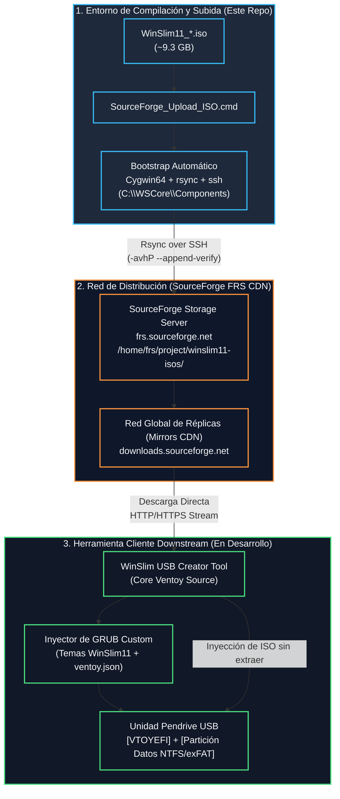
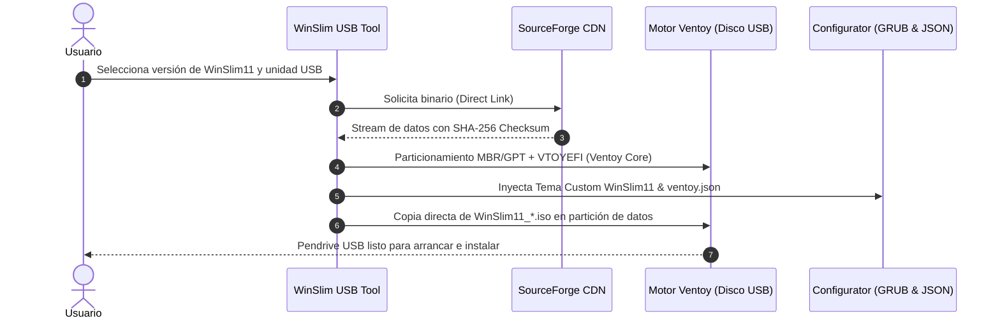

# 🪟 WinSlim11_ISOS

> La primera versión de la herramienta de escritorio para crear USB está en [WinSlimUsbCreator](WinSlimUsbCreator/README.md). La instalación real en USB y el menú de arranque personalizado siguen pendientes de validación.

<div align="center">

[](https://microsoft.com)
[](https://sourceforge.net/projects/winslim11-isos/)
[](https://rsync.samba.org/)
[](https://www.ventoy.net)
[](#análisis-técnico-del-script-sourceforge_upload_isocmd)

<p align="center">
  <b>Infraestructura de almacenamiento, orquestación y despliegue automatizado de imágenes ISO custom de WinSlim11 hacia SourceForge FRS, diseñada para alimentar el ecosistema downstream de creación de medios USB booteables con GRUB personalizado basado en Ventoy.</b>
</p>

[Visión General](#-visión-general) •
[Arquitectura](#-arquitectura-del-sistema) •
[Script de Subida](#-análisis-técnico-del-script-sourceforge_upload_isocmd) •
[Nomenclatura ISO](#-convención-de-nomenclatura-de-isos) •
[Roadmap Herramienta USB](#-ecosistema-futuro-winslim-usb-installer--ventoy-core) •
[Guía de Uso](#-guía-de-despliegue-y-uso) •
[Troubleshooting](#-resolución-de-problemas)

---

</div>

## 📖 Visión General

**WinSlim11** es una distribución personalizada y profundamente optimizada de **Windows 11**, diseñada para maximizar el rendimiento, eliminar telemetría y bloatware innecesario, preservar la estabilidad del sistema operativo y ofrecer una experiencia ultra fluida tanto para entusiastas como para estaciones de trabajo.

Debido al tamaño de las imágenes completas de instalación (típicamente **~9.3 GB** con drivers, runtimes, perfiles optimizados y paquetes acumulativos integrados), la distribución de estos artefactos no es viable a través de repositorios estándar de Git ni cuotas gratuitas de Git LFS (limitadas a 100 MB / 2 GB por archivo y cuotas reducidas de ancho de banda).

Este repositorio (**`WinSlim11_ISOS`**) cumple una doble función estratégica:
1. **Pipeline de Ingesta y Despliegue:** Alojar la lógica de automatización desatendida ([SourceForge_Upload_ISO.cmd](SourceForge_Upload_ISO.cmd)) que autogestiona el entorno de dependencias POSIX (`Cygwin64`, `rsync`, `OpenSSH`), valida los artefactos y realiza transferencias delta resilientes hacia la red CDN de SourceForge.
2. **Backbone de Enlaces Directos para Distribución Automatizada:** Generar y estandarizar los puntos de enlace directos (`downloads.sourceforge.net/project/...`) que serán consumidos por el futuro software cliente: un creador de instaladores USB basado en el código fuente de **Ventoy** con arranque **GRUB personalizado**.

---

## 🏛 Arquitectura del Sistema

El flujo integral comprende desde la generación local de la imagen hasta el despliegue final en el hardware del usuario:



---

## ⚙ Análisis Técnico del Script `SourceForge_Upload_ISO.cmd`

El archivo [`SourceForge_Upload_ISO.cmd`](SourceForge_Upload_ISO.cmd) es un script de orquestación de alto nivel escrito en Windows Batch y PowerShell. Su arquitectura está dividida en 7 capas funcionales:

```
┌────────────────────────────────────────────────────────┐
│ 1. Auto-Elevación UAC Inteligente (cmd /k + RunAs)     │
├────────────────────────────────────────────────────────┤
│ 2. Definición de Parámetros y Endpoints SourceForge    │
├────────────────────────────────────────────────────────┤
│ 3. Bootstrap y Aprovisionamiento Desatendido de Cygwin │
├────────────────────────────────────────────────────────┤
│ 4. Detección Local de Artefactos (*.iso)               │
├────────────────────────────────────────────────────────┤
│ 5. Normalización POSIX y Verificación Cruzada (Bash)   │
├────────────────────────────────────────────────────────┤
│ 6. Transferencia Resiliente Rsync / SSH                │
├────────────────────────────────────────────────────────┤
│ 7. Generación y Visualización de Endpoints Directos    │
└────────────────────────────────────────────────────────┘
```

### 1. Auto-Elevación UAC y Persistencia de Diagnóstico
El script garantiza privilegios administrativos mediante el token de filtro del sistema de archivos (`fltmc`). Si el script se ejecuta en un contexto no privilegiado:
- Lanza un subproceso mediante `PowerShell Start-Process` con el verbo `RunAs`.
- Utiliza deliberadamente `ComSpec /k`: esto asegura que si ocurre cualquier error durante la descarga o la conexión SSH, la ventana de consola **no se cerrará automáticamente**, permitiendo auditar la salida y los logs de depuración.

```bat
powershell.exe -NoProfile -ExecutionPolicy Bypass -Command ^
    "$arg='""' + $env:WS_SCRIPT + '"" __ADMIN__';" ^
    "Start-Process -FilePath $env:ComSpec -ArgumentList '/k',$arg -WorkingDirectory $env:WS_DIR -Verb RunAs"
```

### 2. Configuración del Endpoint de Almacenamiento
Define la configuración centralizada de la cuenta y los destinos en SourceForge:
* **`SF_USER`**: `christianlg97`
* **`SF_HOST`**: `frs.sourceforge.net`
* **`SF_PROJECT`**: `winslim11-isos`
* **`SF_PATH`**: `/home/frs/project/winslim11-isos/`

### 3. Bootstrap Autónomo del Entorno POSIX (`Cygwin64`)
Para evitar requerir que el operador configure manualmente herramientas complejas como Git Bash, WSL o clientes SFTP externos, el script incorpora un mecanismo de despliegue portable:
* **Ubicación Base:** `C:\WSCore\Components\Cygwin64`
* **Doble Estrategia de Descarga:**
  1. *Primaria:* Utiliza `curl.exe` nativo de Windows 10/11 con parámetros de resiliencia (`--fail`, `--retry 3`, `--retry-delay 2`, `--connect-timeout 30`).
  2. *Fallback Secundario:* En caso de anomalía, conmuta a `PowerShell Invoke-WebRequest -UseBasicParsing`.
* **Instalación Silenciosa:** Invoca `setup-x86_64.exe` sin interfaz gráfica (`-q`), instalando únicamente los paquetes esenciales: `rsync` y `openssh`.
* **Limpieza Automática:** Elimina los instaladores y carpetas temporales de caché en `%TEMP%`.

### 4. Detección de Archivos y Normalización POSIX
* Localiza todas las imágenes `*.iso` presentes en el directorio del script.
* Convierte las rutas absolutas de Windows (ej. `C:\Users\...\archivo.iso`) a rutas virtuales POSIX (ej. `/cygdrive/c/Users/...`) usando `cygpath.exe -u`.
* Ejecuta una comprobación de existencia directa dentro del entorno Bash (`bash.exe -lc "test -f '<ISO_POSIX>'"`), garantizando que las capas de permisos y rutas sean totalmente válidas antes de iniciar transferencias de red pesadas.

### 5. Motor de Transferencia con Rsync sobre SSH
La subida de archivos de ~9.3 GB a través de redes WAN requiere un protocolo con verificación de bloques y reanudación automática. El script ejecuta:

```bat
"%CYG_BIN%\rsync.exe" ^
    -avhP ^
    --append-verify ^
    --protect-args ^
    -e "/usr/bin/ssh" ^
    "%ISO_POSIX%" ^
    "%SF_USER%@%SF_HOST%:%SF_PATH%"
```

#### Parámetros Clave de Rsync:
| Parámetro | Función | Importancia en WinSlim11 |
| :--- | :--- | :--- |
| `-a` (`--archive`) | Modo archivo recursivo, preserva marcas de tiempo y permisos. | Mantiene los metadatos idénticos al compilado original. |
| `-v` (`--verbose`) | Detalle informativo en pantalla. | Monitoreo en tiempo real del progreso. |
| `-h` (`--human-readable`) | Formato de unidades legibles (MB, GB, KB/s). | Claridad visual del rendimiento de subida. |
| `-P` | Combina `--progress` y `--partial`. | Si la conexión se interrumpe al 80%, el archivo parcial no se descarta. |
| `--append-verify` | **Crucial:** Reanuda la transferencia desde el último byte exacto y verifica checksums de datos previos. | Ahorra horas de resubida ante cortes de red o reinicios. |
| `--protect-args` | Previene que el shell remoto interprete espacios o caracteres especiales en el nombre. | Compatibilidad garantizada con nombres complejos de compilación. |
| `-e "/usr/bin/ssh"` | Canaliza el flujo a través del cliente OpenSSH de Cygwin. | Cifrado seguro y autenticación estándar por claves SSH o contraseña. |

---

## 🏷 Convención de Nomenclatura de ISOs

Las compilaciones de WinSlim11 siguen una nomenclatura estructurada y determinista. Tomando como referencia la versión DEV actual:

$$\Large \texttt{WinSlim11\_ESx64\_R1.5\_P-2.2.2\_240926\_Rev62\_DEV.iso}$$

```
WinSlim11 _ ESx64 _ R1.5 _ P-2.2.2 _ 240926 _ Rev62 _ DEV .iso
   │         │       │        │        │       │       │
   │         │       │        │        │       │       └── Rama / Canal (DEV / RELEASE)
   │         │       │        │        │       └────────── Revisión interna del build engine
   │         │       │        │        └────────────────── Fecha de compilación (YYMMDD: 24 Sep 2026)
   │         │       │        └─────────────────────────── Perfil de optimización WinSlim (Preset v2.2.2)
   │         │       └──────────────────────────────────── Versión mayor/menor de WinSlim11 (Release 1.5)
   │         └──────────────────────────────────────────── Idioma (Español) y Arquitectura (x64 / AMD64)
   └────────────────────────────────────────────────────── Familia del Sistema Operativo
```

### URLs de Acceso Resultantes

Una vez completada la subida por el script, los enlaces quedan accesibles públicamente:

* **Portal del Repositorio en SourceForge:**
  `https://sourceforge.net/projects/winslim11-isos/files/`
* **Endpoint de Descarga Directa (Resuelto por CDN Mirror):**
  `https://downloads.sourceforge.net/project/winslim11-isos/<NOMBRE_ARCHIVO_ISO>`
* **Ejemplo para la compilación actual:**
  `https://downloads.sourceforge.net/project/winslim11-isos/WinSlim11_ESx64_R1.5_P-2.2.2_240926_Rev62_DEV.iso`

> [!TIP]
> El endpoint `downloads.sourceforge.net/project/...` redirige automáticamente mediante cabeceras HTTP `302 Found` al mirror geográficamente más cercano y con mayor ancho de banda disponible, facilitando descargas a máxima velocidad en cualquier parte del mundo.

---

## 🚀 Ecosistema Futuro: WinSlim USB Installer & Ventoy Core

Este repositorio constituye la primera etapa de una arquitectura más amplia. Los enlaces directos generados aquí serán consumidos por una aplicación independiente que se desarrollará próximamente: **WinSlim USB Boot Tool**.

### Objetivo de la Herramienta Downstream

Crear un instalador "Zero-Hassle" (un solo clic) para el usuario final:
1. **Descubrimiento y Descarga:** La aplicación consultará los artefactos disponibles en SourceForge, ofrecerá al usuario elegir la edición (Release estable, DEV, perfiles específicos) y gestionará la descarga acelerada multihilo con verificación de hash SHA-256.
2. **Motor Ventoy Core:** Aprovechando el código fuente abierto de **Ventoy** ([ventoy/Ventoy](https://github.com/ventoy/Ventoy)):
   - Formateará la unidad USB seleccionada creando la tabla de particiones dual estándar (partición de arranque oculta `VTOYEFI` formateada en FAT + partición principal para datos en exFAT o NTFS).
   - Instalará el core de arranque Ventoy sin requerir herramientas de terceros (como Rufus o BalenaEtcher).
3. **GRUB Personalizado y Branding WinSlim11:**
   - Inyección de un tema visual exclusivo de GRUB2 adaptado con la identidad visual de WinSlim11 (resolución nativa 1080p/4K, tipografías elegantes, iconos modernos).
   - Inyección y configuración automática de `ventoy/ventoy.json` con:
     - **Bypass Automático:** Eliminación de chequeos de TPM 2.0, Secure Boot, RAM mínima de 4GB y requisito de cuenta Microsoft en Windows 11.
     - **Menú de Arranque Custom:** Alias limpios para las ISOs, ocultando nombres técnicos largos y ofreciendo opciones de instalación desatendida directa.
4. **Despliegue Directo de la ISO:**
   - La ISO se coloca directamente en el pendrive sin extraer su contenido, permitiendo que la unidad USB conserve su capacidad de almacenamiento habitual y admita múltiples sistemas si el usuario lo desea.



---

## 🛠 Guía de Despliegue y Uso

### Prerrequisitos
* Sistema Operativo: **Windows 10 / Windows 11** (x64).
* Conexión a Internet activa (para descargar Cygwin en la primera ejecución y para la subida).
* Espacio en disco:
  * ~300 MB libres en `C:\` para la instalación de Cygwin en `C:\WSCore\Components\Cygwin64`.
* Cuenta en SourceForge con permisos de escritura en el proyecto `winslim11-isos`.
* *(Recomendado)* Llave pública SSH agregada en el perfil de SourceForge (`Account Settings > SSH Keys`), para evitar ingresar la contraseña en cada subida.

### Procedimiento de Subida Paso a Paso

1. **Colocar la ISO:**
   Copia o mueve la imagen ISO compilada (ej. `WinSlim11_ESx64_R1.5_P-2.2.2_240926_Rev62_DEV.iso`) dentro del mismo directorio donde reside [`SourceForge_Upload_ISO.cmd`](SourceForge_Upload_ISO.cmd).

2. **Ejecutar el Script:**
   Haz doble clic sobre [`SourceForge_Upload_ISO.cmd`](SourceForge_Upload_ISO.cmd) o ejecútalo desde un terminal:
   ```cmd
   .\SourceForge_Upload_ISO.cmd
   ```

3. **Concesión UAC:**
   Acepta la ventana del Control de Cuentas de Usuario (UAC) para permitir la elevación.

4. **Instalación Inicial de Dependencias (Solo primera vez):**
   Si Cygwin64 no se encuentra instalado en `C:\WSCore`, el script descargará el instalador oficial, aprovisionará `rsync` y `openssh`, y verificará los binarios de manera totalmente desatendida.

5. **Aceptación de Clave SSH:**
   En la primera conexión a `frs.sourceforge.net`, OpenSSH preguntará:
   ```text
   The authenticity of host 'frs.sourceforge.net (...)' can't be established.
   Are you sure you want to continue connecting (yes/no/[fingerprint])?
   ```
   Escribe **`yes`** y presiona <kbd>Enter</kbd>.

6. **Autenticación:**
   Introduce tu contraseña de SourceForge (o tu passphrase de clave SSH si está protegida).

7. **Monitoreo y Finalización:**
   Rsync mostrará una barra de progreso interactiva con porcentaje, velocidad en MB/s y tiempo estimado. Al finalizar, se imprimirán los enlaces de descarga directa generados.

---

## 🔍 Resolución de Problemas

> [!NOTE]
> La consola se mantiene deliberadamente abierta al finalizar (`CMD /K` y `pause`) para asegurar que puedas examinar los códigos de retorno en caso de anomalías.

### 1. `Host key verification failed`
* **Causa:** La firma del servidor de SourceForge cambió o existe una entrada corrupta en el archivo `known_hosts`.
* **Solución:** Abre la terminal de Cygwin en `C:\WSCore\Components\Cygwin64\bin` y ejecuta:
  ```bash
  ssh-keygen -R frs.sourceforge.net
  ```

### 2. `Connection refused` o `Connection timed out` en el puerto 22
* **Causa:** El cortafuegos de tu red o router bloquea conexiones salientes por el puerto SSH estándar (22).
* **Solución:** Comprueba que el puerto 22 saliente TCP esté habilitado en Windows Defender Firewall y en tu router.

### 3. Transferencia interrumpida a mitad de camino
* **Causa:** Microcortes de ISP, cierre accidental o suspensión del equipo.
* **Solución:** Simplemente vuelve a ejecutar el script. Gracias a las banderas `-P` y `--append-verify`, `rsync` comprobará los bloques ya subidos y continuará exactamente desde el punto de interrupción.

### 4. `No se encontró ninguna ISO`
* **Causa:** El archivo `.iso` no se encuentra en la misma carpeta que el script `SourceForge_Upload_ISO.cmd`.
* **Solución:** Asegúrate de que el archivo tenga la extensión `.iso` (no `.iso.tmp` ni nombres ocultos) y esté en la raíz del repositorio.

---

## 📁 Estructura del Repositorio

```text
WinSlim11_ISOS/
├── .gitattributes             # Configuración de políticas Git LFS de resguardo
├── .gitignore                 # Exclusión estricta de binarios *.iso de Git
├── README.md                  # Documentación maestra y especificaciones técnicas
├── SourceForge_Upload_ISO.cmd # Orquestador automatizado de subidas a SourceForge FRS
└── WinSlim11_*.iso            # Imágenes ISO compiladas (almacenadas localmente / ignoradas en Git)
```

### Política de Exclusiones Git
* [`.gitignore`](.gitignore): Contiene la regla `*.iso` para proteger el repositorio de commits accidentales que superen el límite estricto de 100 MB de GitHub.
* [`.gitattributes`](.gitattributes): Define reglas Git LFS para futuros recursos binarios imprescindibles; las ISO locales permanecen ignoradas.

---

## 👤 Autor y Licencias

* **Creador y Desarrollador:** Christian González ([@Christianlg97](https://github.com/Christianlg97))
* **Proyecto SourceForge:** [winslim11-isos](https://sourceforge.net/projects/winslim11-isos/)
* **Tecnologías Asociadas:** Windows 11, Cygwin Project, Rsync (GNU GPL), OpenSSH (BSD), Ventoy (GPLv3).

---
<div align="center">
  <sub>Diseñado con precisión para el ecosistema WinSlim11 • 2026</sub>
</div>
